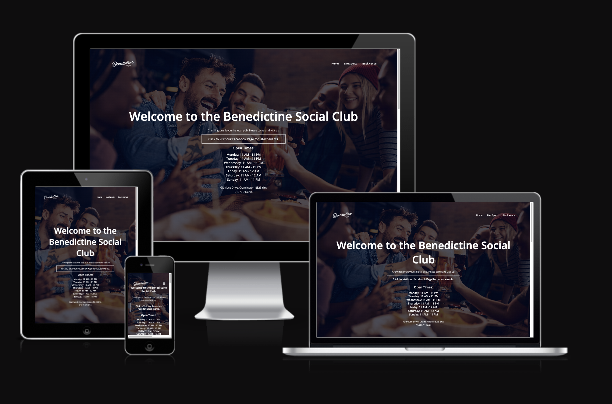

# Benedictine Pub
(Developer: Michael Ray)

[Live webpage](https://michaelray2.github.io/Benedictine-Pub-VS-Code/)

## Table of Content

1. [Project Goals](#project-goals)
    1. [User Goals](#user-goals)
    2. [Site Owner Goals](#site-owner-goals)
2. [User Experience](#user-experience)
    1. [Target Audience](#target-audience)
    2. [User Requrements and Expectations](#user-requrements-and-expectations)
    3. [User Stories](#user-stories)
3. [Design](#design)
    1. [Design Choices](#design-choices)
    2. [Colour](#colours)
    3. [Fonts](#fonts)
    4. [Structure](#structure)
    5. [Wireframes](#wireframes)
4. [Technologies Used](#technologies-used)
    1. [Languages](#languages)
    2. [Frameworks & Tools](#frameworks-&-tools)
5. [Features](#features)
6. [Testing](#validation)
    1. [HTML Validation](#HTML-validation)
    2. [CSS Validation](#CSS-validation)
    3. [Accessibility](#accessibility)
    4. [Performance](#performance)
    5. [Device testing](#performing-tests-on-various-devices)
    6. [Browser compatibility](#browser-compatability)
    7. [Testing user stories](#testing-user-stories)
8. [Bugs](#Bugs)
9. [Deployment](#deployment)
10. [Credits](#credits)
11. [Acknowledgements](#acknowledgements)

## Project Goals 

### User Goals
- To be able to visit the website of a local pub.
- See a description of the pub's history, social activities and facilities  on offer .
- To be able to see which sports channels are being shown at the pub.
- Find the location of the pub.

### Site Owner Goals
- Increase in the number of customers to the pub.
- Promote the business.
- Provide an internet presence for the business to reach a new market.
- Provide essential information about the bussines to customers.
- Provide an easy way to access the pub's Facebook page.

## User Experience

### Target Audience
- People looking for a place to watch sports.
- People looking to drink alcohol socially.
- People interested in joining a social clubs e.g. darts.
- People looking at hiring a large venue for an occasion.

### User Requrements and Expectations

- A simple and intuitive navigation system
- Quickly and easily find relevant information
- Links and functions that work as expected.
- Good presentation and a visually appealing design regardless of screen size.
- An easy way to contact the contact the pub.
- An easy way to locate the pub.
- Simple content that the user can skim read as well as more in-depth content for those more interested.
- Accessibility for all.

### User Stories

#### First-time User 
1. As a first time user, I want to know where the pub is located.
2. As a first time user, I want to know what facilities the pub has.
3. As a first time user, I want to know more about the activities on offer.
4. As a first time user, I want to know what sports I can watch.

#### Returning User
5. As a returning user, I want to visit the facebook page.
6. As a returnign user, I want to check which sports are on this weekend.
7. As a returning user, I want to book a venue for a party.
8. As a returning user, I want to make sure the pub is open when I plan to visit.

#### Site Owner 
13. As the site owner, I want the pub to have an online presence like local competitors.
14. As the site owner, I want users to get to know the restaurant. 
15. As the site owner, I want the users to be able to contact us.

## Design

### Design Choices
The webpage was designed with the a minimalstic approach where the experience is as easy as possible for the user with only 3 pages. The dark red-ish tones of the site aim to give the user a feel of the pub as they match what is inside the pub.

### Colour
I decided upon the colour based on the fact I wanted most of the text to be white as I believe this looks the most professional. Therefore, a maroon, dark red-ish colour would be a suitable colour scheme for this text. The interior of the pub also contains a lot of dark red.

### Fonts
After some research it seemed like the nost professional font and the font that was most used for pubs was the "Open-Sans" font. Therefore, this font was used.

### Structure
The page is structured in a well know, recognizable, user friendly, and easy to learn way. Upon arriving to the website the user sees a familiar type of navigation bar with the restaurant logo on the left side and the navigation links to the right. On larger screens this navigation links don't require an extra click.
The website consists of three separate pages: 
- A home page with 4 sections. 
    1) section for header. 
    2) Section for about-us info.
    3) Section to display the pubs venues.
    4) Section to display the pubs location.
- A page that shows the Live Sports the pub shows. 2 sections.
    1) section for header
    2) section for Live Sports

## Technologies Used

### Languages
- HTML
- CSS
- JavaScript

### Frameworks & Tools
- Git
- GitHub
- Gitpod
- Balsamiq
- Google Fonts
- Font Awesome
- Favicon
- Visual Studio Code

### Logo and Navigation Bar
- Featured on all three pages. The header section is smaller on the 2 pages that are not the home page.
- The navbar is fully responsive and changes to a toggler (hamburger menu icon) on smaller screens and includes
links to the Homepage, Live Sports, and Book a Venue.
- An "x" icon allowes the user to close the nav menu when they're done using it.
- It allows users to easily navigate the page irrespective of screen size.
- When the user hovers over a link, the link will reveal a blue underline.

![Logo and navbar] (docs/features/logo_and_navbar.png)

### Header and header button link to Facebook
- The current main method of communication of the pub is through Facebook. Therefore, it is important to have a large button for the user to get to the facebook page.
- Within the header on the main page the user will be able to see a contact number and opening times. This is only visible on the home page as it would take up unnecessary space on the other pages.

![Logo, navbar and header] (docs/features/logo_and_navbar_header.png)

### About_us
- A simply styled section that allowes user to gain an understanding of the pub's history, the facilities and the social activities.
- If the user hovers over a div, a shadow will appear around the information.

![About us] (docs/features/about_us.png)

### Our Venues
- Shows the user 3 images of stand-out facilities that the pub has to offer. 

![Our Venues] (docs/features/our_venues.png)

### Our Location
- SHows the user a live google maps location of the pub.

![Our Location] (docs/features/our_location.png)
