# Benedictine Pub
(Developer: Michael Ray)

[Live webpage](https://michaelray2.github.io/Benedictine-Pub-VS-Code/)

## Table of Content

1. [Project Goals](#project-goals)
    1. [User Goals](#user-goals)
    2. [Site Owner Goals](#site-owner-goals)
2. [User Experience](#user-experience)
    1. [Target Audience](#target-audience)
    2. [User Requrements and Expectations](#user-requrements-and-expectations)
    3. [User Stories](#user-stories)
3. [Design](#design)
    1. [Design Choices](#design-choices)
    2. [Colour](#colours)
    3. [Fonts](#fonts)
    4. [Structure](#structure)
    5. [Wireframes](#wireframes)
4. [Technologies Used](#technologies-used)
    1. [Languages](#languages)
    2. [Frameworks & Tools](#frameworks-&-tools)
5. [Features](#features)
6. [Testing](#validation)
    1. [HTML Validation](#HTML-validation)
    2. [CSS Validation](#CSS-validation)
    3. [Accessibility](#accessibility)
    4. [Performance](#performance)
    5. [Device testing](#performing-tests-on-various-devices)
    6. [Browser compatibility](#browser-compatability)
    7. [Testing user stories](#testing-user-stories)
8. [Bugs](#Bugs)
9. [Deployment](#deployment)
10. [Credits](#credits)
11. [Acknowledgements](#acknowledgements)

## Project Goals 

### User Goals
- To be able to visit the website of a local pub.
- See a description of the pub's history, social activities and facilities  on offer .
- To be able to see which sports channels are being shown at the pub.
- Find the location of the pub.

### Site Owner Goals
- Increase in the number of customers to the pub.
- Promote the business.
- Provide an internet presence for the business to reach a new market.
- Provide essential information about the bussines to customers.
- Provide an easy way to access the pub's Facebook page.

## User Experience

### Target Audience
- People looking for a place to watch sports.
- People looking to drink alcohol socially.
- People interested in joining a social clubs e.g. darts.
- People looking at hiring a large venue for an occasion.

### User Requrements and Expectations

- A simple and intuitive navigation system
- Quickly and easily find relevant information
- Links and functions that work as expected.
- Good presentation and a visually appealing design regardless of screen size.
- An easy way to contact the contact the pub.
- An easy way to locate the pub.
- Simple content that the user can skim read as well as more in-depth content for those more interested.
- Accessibility for all.

### User Stories

#### First-time User 
1. As a first time user, I want to know where the pub is located.
2. As a first time user, I want to know what facilities the pub has.
3. As a first time user, I want to know more about the activities on offer.
4. As a first time user, I want to know what sports I can watch.

#### Returning User
5. As a returning user, I want to visit the facebook page.
6. As a returning user, I want to book a venue for a party.
7. As a returning user, I want to make sure the pub is open when I plan to visit.

#### Site Owner 
8. As the site owner, I want the users to be able to contact us. 
9. As the site owner, I want the pub to have an online presence like local competitors. 
10. As the site owner, I want users to get to know the restaurant.

## Design

### Design Choices
The webpage was designed with the a minimalstic approach where the experience is as easy as possible for the user with only 3 pages. The dark red-ish tones of the site aim to give the user a feel of the pub as they match what is inside the pub.

### Colour
I decided upon the colour based on the fact I wanted most of the text to be white as I believe this looks the most professional. Therefore, a maroon, dark red-ish colour would be a suitable colour scheme for this text. The interior of the pub also contains a lot of dark red.

### Fonts
After some research it seemed like the nost professional font and the font that was most used for pubs was the "Open-Sans" font. Therefore, this font was used.

### Structure
The page is structured in a well know, recognizable, user friendly, and easy to learn way. Upon arriving to the website the user sees a familiar type of navigation bar with the restaurant logo on the left side and the navigation links to the right. On larger screens this navigation links don't require an extra click.
The website consists of three separate pages: 
- A home page with 4 sections. 
    1) section for header. 
    2) Section for about-us info.
    3) Section to display the pubs venues.
    4) Section to display the pubs location.
- A page that shows the Live Sports the pub shows. 2 sections.
    1) section for header
    2) section for Live Sports

## Technologies Used

### Languages
- HTML
- CSS
- JavaScript

### Frameworks & Tools
- Git
- GitHub
- Gitpod
- shutterstock
- Unsplash
- Balsamiq
- Google Fonts
- Font Awesome
- Favicon
- Visual Studio Code

### Logo and Navigation Bar
- Featured on all three pages. The header section is smaller on the 2 pages that are not the home page.
- The navbar is fully responsive and changes to a toggler (hamburger menu icon) on smaller screens and includes
links to the Homepage, Live Sports, and Book a Venue.
- An "x" icon allowes the user to close the nav menu when they're done using it.
- It allows users to easily navigate the page irrespective of screen size.
- When the user hovers over a link, the link will reveal a blue underline.

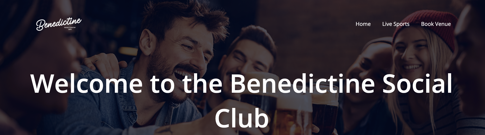

### Header and header button link to Facebook
- The current main method of communication of the pub is through Facebook. Therefore, it is important to have a large button for the user to get to the facebook page.
- Within the header on the main page the user will be able to see a contact number and opening times. This is only visible on the home page as it would take up unnecessary space on the other pages.

### About_us
- A simply styled section that allowes user to gain an understanding of the pub's history, the facilities and the social activities.
- If the user hovers over a div, a shadow will appear around the information.

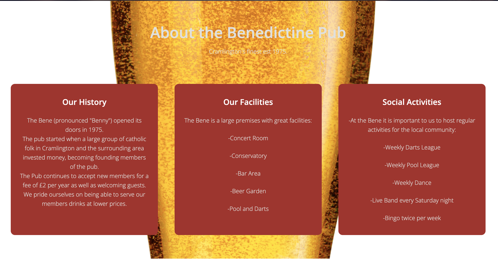

### Our Venues
- Shows the user 3 images of stand-out facilities that the pub has to offer. 

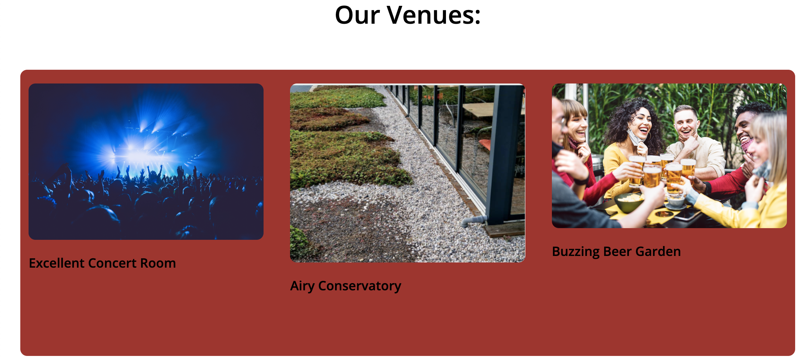

### Our Location
- Shows the user a live google maps location of the pub.

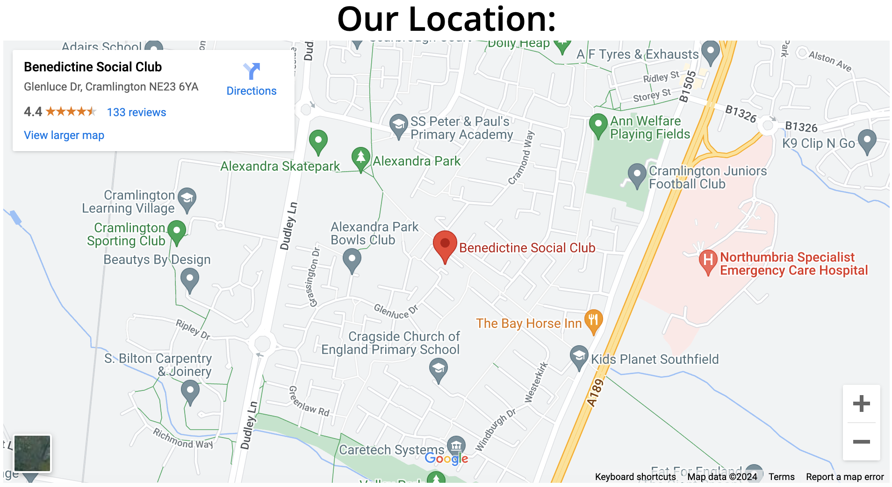

### Footer
- Displays icons of the 4 key social media platforms.
- Featured on all 3 pages.
 

### Live Sports
- Displays the icons of the three channels that are broadcasted. 
- If the user hovers over them a shadow will appear.
- If the user clicks on the icon, they will be taken to the fixture lists.

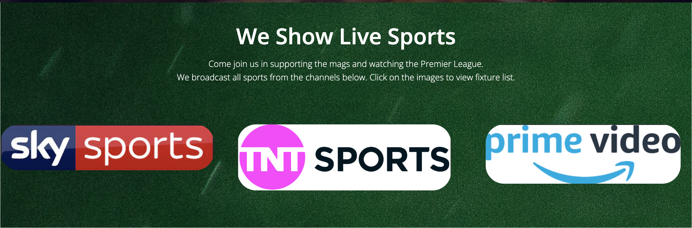

### Request Venue
- Presents a form for the user to fill in in order to request a venue they want to hire.

## Validation 

### HTML Validation
The W3C Markup Validation Service was used to validate the HTML of the website. All pages pass with no errors no warnings to show.

Home

Sports

Venue

### CSS Validation
The W3C Jigsaw CSS Validation Service was used to validate the CSS of the website.

style.css

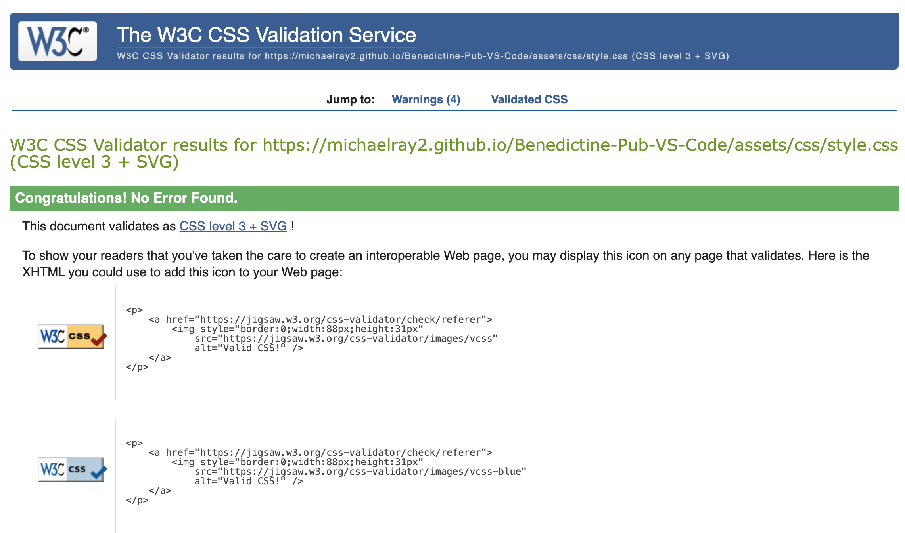

### Accessibility
The WAVE WebAIM web accessibility evaluation tool was used to ensure the website met high accessibility standards. All pages pass with 0 errors. There were 2 contrast errors within the "sport" page. However after looking into this the contrast between the text and background appears to be fine.

Home

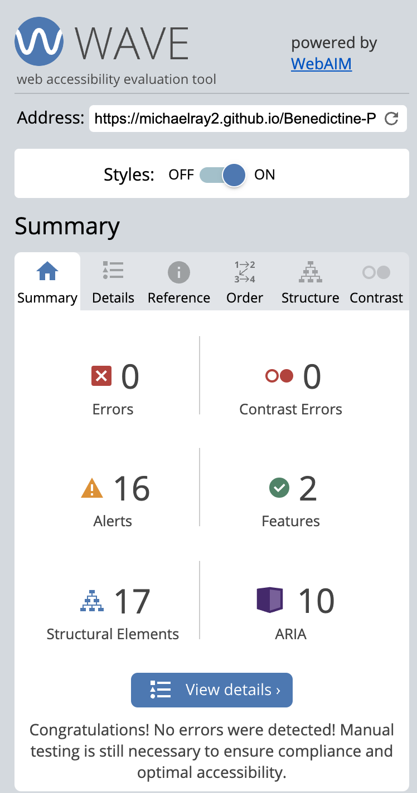

About

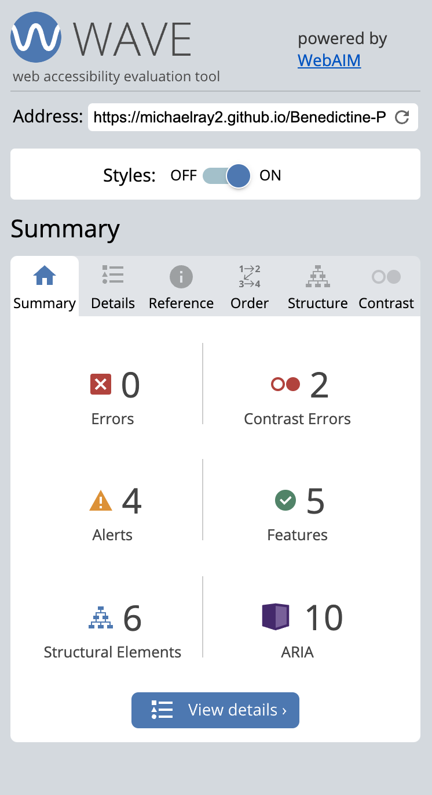

Menu

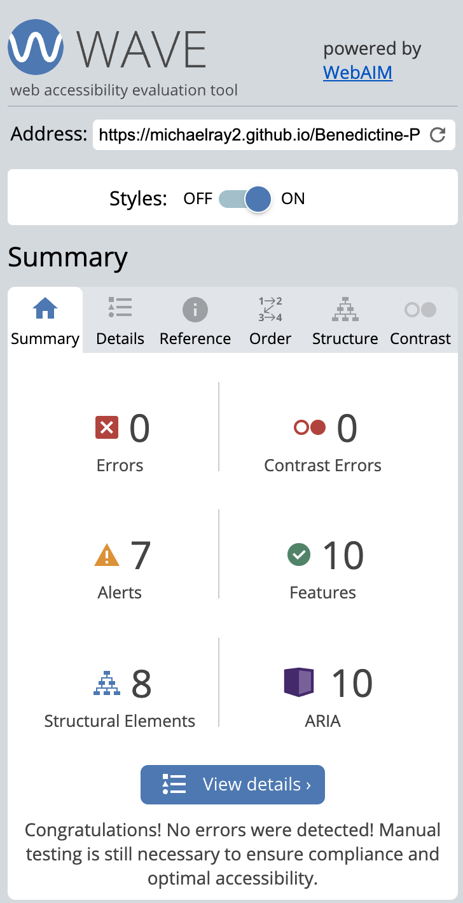

### Performance

Home

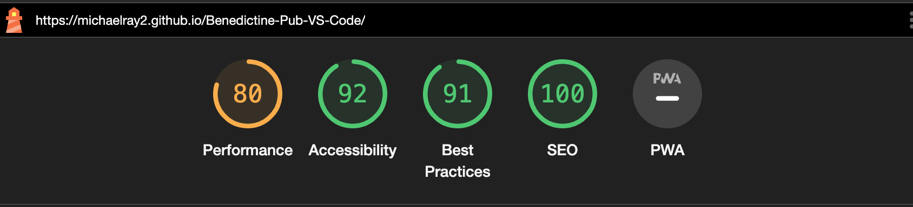

Sports

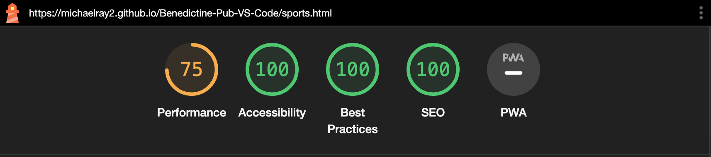

Venue

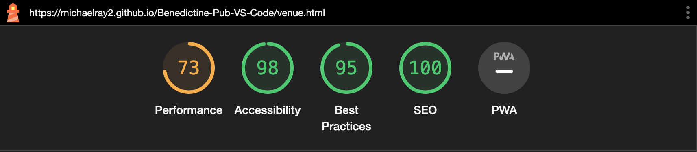

### Performing tests on various devices 
The website was tested on the following devices:
- MacBook Pro 14" 
- LG Ultrafine 4K monitor
- Iphone 11 Pro 
- All modes on google's "inspect" feature

### Browser compatability
The website was tested on the following browsers:
- Google Chrome
- Safari

### Testing User Stories

1. As a first time user, I want to know where the pub is located

| **Feature** | **Action** | **Expected Result** | **Actual Result** |
|-------------|------------|---------------------|-------------------|
| Map | Navigate to the bottom of the home page, locate the Google Map | User sees a map showing the location of the pub | Works as expected |

Screenshot

2. As a first time user, I want to know what facilities the pub has.

| **Feature** | **Action** | **Expected Result** | **Actual Result** |
|-------------|------------|---------------------|-------------------|
| Section with images of the pub's facilities | Navigate to the bottom of down the home page until user sees "venues:" | User sees a three images of the main facilities at the pub | Works as expected |

Screenshot

3. As a first time user, I want to know more about the activities on offer.

| **Feature** | **Action** | **Expected Result** | **Actual Result** |
|-------------|------------|---------------------|-------------------|
| Div element within the about_us section that describes social club people can join. | Navigate down the home page until the Social activities section is reached. | User sees a maroon box filled with text describing the social activities that can be done. | Works as expected |

Screenshot

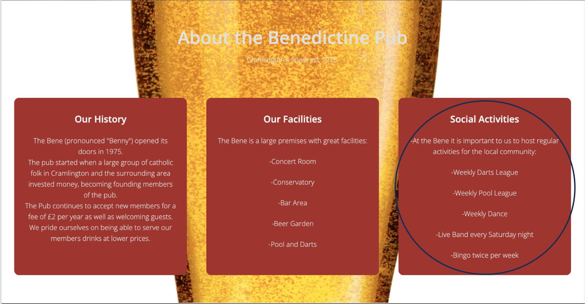

4. As a first time user, I want to know what sports I can watch.

| **Feature** | **Action** | **Expected Result** | **Actual Result** |
|-------------|------------|---------------------|-------------------|
| Links to different sports channels on the sports page. | Click on the sports tab along the navigation div and scroll down to Live sports | User sees three available channels to choose from and it taken to the respective websites when clicked | Works as expected |

Screenshots

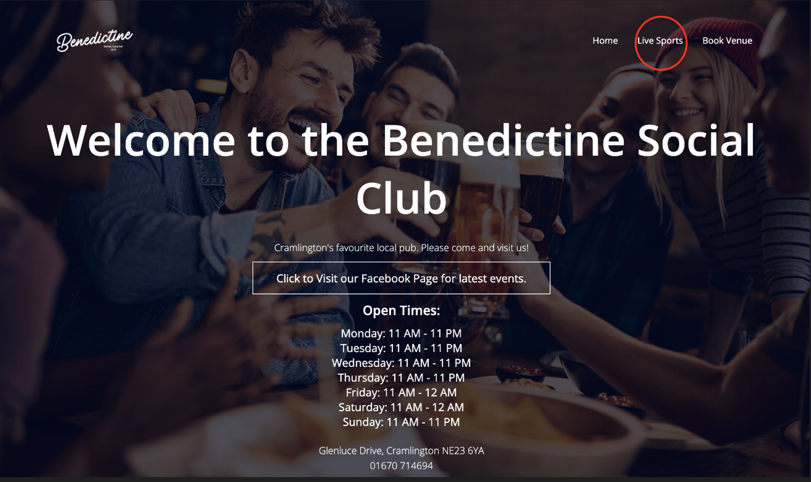

5. As a returning user, I want to visit the pub's facebook page.

| **Feature** | **Action** | **Expected Result** | **Actual Result** |
|-------------|------------|---------------------|-------------------|
| Button that highlights when hovered over | Click on the big button on the header section. | User clicks button and is taken to the pub's facebook page. | Works as expected |

Screenshots

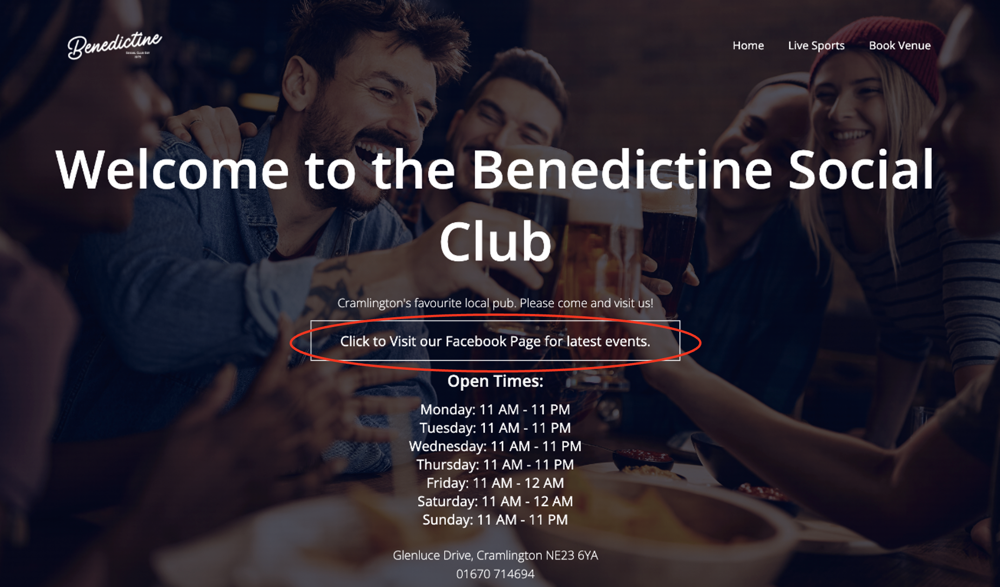
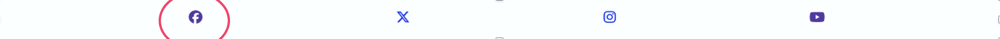

6. As a returning user, I want to book a venue for a party.

| **Feature** | **Action** | **Expected Result** | **Actual Result** |
|-------------|------------|---------------------|-------------------|
| Form that allowes the user to enter information and a button to submit the form | Navigate to the "Book Venue" page and enter all information before clicking "request". The user should be told if an entry is not acceptable | form is theoretically sent and bad entrys are rejected| Works as expected |

Screenshots

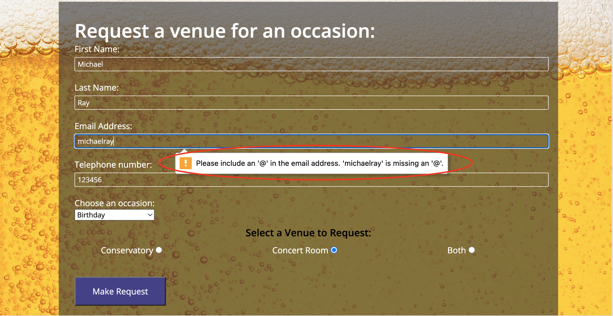

7. As a returning user, I want to make sure the pub is open when I plan to visit.

| **Feature** | **Action** | **Expected Result** | **Actual Result** |
|-------------|------------|---------------------|-------------------|
| A text box on the home page header that details the openign times of the pub | Open the pub's website and the opening times are immediately visible | The user gets to see the open times of the pub | Works as expected |

Screenshots

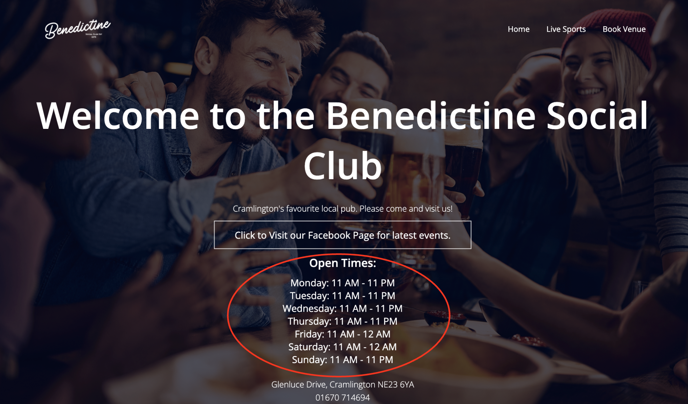

8. As the site owner, I want the users to be able to contact us.

| **Feature** | **Action** | **Expected Result** | **Actual Result** |
|-------------|------------|---------------------|-------------------|
| The pub has a contact number at the bottom of the header on the home page | Open the pub's website and the contact number is displayed at the bottom of the header section. | The user gets to see the telephone number | Works as expected |

Screenshots

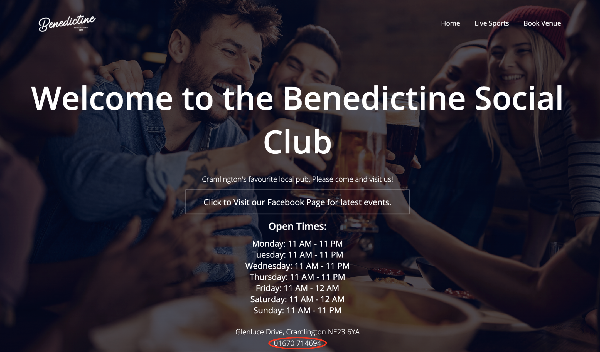

9. As the site owner, I want the pub to have an online presence like local competitors.
    - The website will provide a presents on the web
    - Time will tell how much traffic the website generates
10. As the site owner, I want users to get to know the restaurant.
    - After the website launches, we will be able to track how much time user's spend on the website and the level of interaction.

## Bugs

| **Bug** | **Fix** |
| ----------- | ----------- |
| Some of the fonts do not stand out from the background on some devices | create a media query addressing font colour on certain devices. |
| The user can submit a request form input without a message | Add required attribute to message input field |
| Open times text was pushing too high up the page overlapping with the button| Move open times div to within the same button as the div so they can be scaled relatively. |
| Within the "sports" page, the channel icons were not sizing properly | Increased the flex-basis on laptop screens to 70% and increased it to 300% on smaller devices. |
| The foam of the beer drink in the background goes behind the light text on smaller devices. | Change colour of this text to black. |

## Credits
Images not referenced below are owned by the developer.

### Media 
In order of appearance:
- [main_pub](assets/images/pub_main.jpg): <a href="https://www.shutterstock.com/image-photo/multiracial-group-happy-friends-having-fun-2281411833"> Shutterstock photo</a>
- [pub_beer](assets/images/pub_beer.jpg): <a href="https://www.shutterstock.com/image-photo/">Shutterstock photo</a>
- [concert_room](assets/images/concert_room.jpg): <a href="https://www.shutterstock.com/image-photo/">Shutterstock photo</a>
- [conservatory](assets/images/conservatory.jpg): <a href="https://www.istockphoto.com/photo/glass-terrace-on-the-roof-garden-with-succulent-plants-and-pebbles-gray-aluminum-gm1738500078-542450022">beekeepx, Unsplash</a>
- [beer_garden](assets/images/beer_garden.jpg): <a href="https://www.shutterstock.com/image-photo/multicultural-people-toasting-beer-wearing-open-1937176303">Shutterstock photo</a>
- [premier_league_balls](assets/images/premier_league_balls.jpg):    <a href="https://unsplash.com/photos/pile-of-yellow-orange-and-red-nike-soccer-balls-ObhCU6Vhoe8">Nathan Rogers, Unsplash photo</a>
- [beer_bubbles](assets/images/beer_bubbles.jpg): <a href="https://www.shutterstock.com/catalog/licenses">Shutterstock Photo</a>
- [drunk_man](assets/images/drunk_man.png): <a href="https://www.istockphoto.com/search/search-by-asset?affiliateredirect=true&assetid=1182394451&assettype=image&utm_campaign=srp_photos_bottom&utm_content=https%3A%2F%2Funsplash.com%2Fs%2Fphotos%2Fdrunk-man&utm_medium=affiliate&utm_source=unsplash&utm_term=drunk+man%3A%3A%3A">iStock</a>
- [sky_sports](assets/images/sky_sports_logo.png): <a href="https://www.skysports.com/">Sky Sports</a>
- [tnt_sports](assets/images/tnt_sports_logo.png): <a href="https://www.tntsports.co.uk/">TNT Sports</a>
- [amazon_prime](assets/images/amazon_prime_logo.png): <a href="https://www.amazon.co.uk/gp/video/storefront/?contentType=home&contentId=store&filterId=OFFER_FILTER=SUBSCRIPTIONS&ref_=DVM_PDS_AMC_UK_mi_C_mkw_s7M84aZQO-dc_pcrid_638768559978&mrntrk=slid__pgrid_138861087325_pgeo_1006659_x__ptid_kwd-3151046130&gclid=EAIaIQobChMI4rKVvJbrgwMVfJ1QBh2t2wNWEAAYASAAEgKMV_D_BwE">Amazon Prime</a>

### Code
- The JavaScript function that allowes the user to open and close the nav menu on smaller devices was taken from <a href="https://   youtu.be/oYRda7UtuhA?si=7g_BFEmcsmJUYcbP">here.</a> 
- The footer code was taken from the Love Running walk-through project by the code institute.
- The creative design of the website was inspired by my own thought and some trial and error in order to get the code to work.
- 404 page was build using description on GitHub Docs

## Acknowledgements
I would like to take the opportunity to thank:
- My mentor Mo Shami for the project advice and the feedback given along the way as well as the short notice help given the tight deadlines.
- The Benedictine pub for encouraging me to create the website and for advising me on what they'd like it contain.
